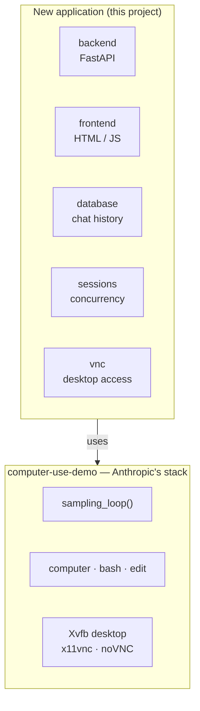

# Computer Use Agent Service

A FastAPI-based backend and web interface for an AI computer-use agent,
built by extending Anthropic's Computer Use Demo.

This repository started as a fork of Anthropic's Claude Quickstarts. The
only quickstart under active development here is the **Computer Use
Demo** (`computer-use-demo/`); the others are retained for reference.

## Goal

Anthropic's Computer Use Demo ships a working agent stack — the agent
loop, the Claude API integration, the computer/bash/edit tools, and a
containerised Linux desktop — behind a single-user Streamlit UI that
keeps all of its state in memory.

This project keeps that agent stack and builds a real service on top of
it: a FastAPI backend with session APIs, streamed progress, persisted
chat history, and support for several concurrent sessions.

## Requirements

1. **Reuse the existing computer-use agent stack** from
   [anthropic-quickstarts/computer-use-demo](https://github.com/anthropics/anthropic-quickstarts/tree/main/computer-use-demo)
   rather than reimplementing the loop or the tools.
2. **Replace the experimental Streamlit interface with a FastAPI
   backend** providing:
   - session creation and management APIs;
   - real-time progress streaming (WebSocket, SSE, or equivalent);
   - a VNC connection to the virtual machine;
   - database persistence for chat history;
   - support for simultaneous concurrent sessions without race
     conditions.
3. **Docker setup** for both local development and remote deployment.
4. **A simple frontend** (basic HTML/JS) that demonstrates the APIs.

## How it fits together

The new application sits on top of Anthropic's stack and drives it. The
upstream code stays where it is and is treated as a dependency, not as
something to fork line by line.



From the upstream stack we get the agent loop that talks to Claude and
executes tool calls, the three tools it drives, and a container image
running a Linux desktop with VNC already exposed. What it does not give
us is any way to reach that from outside a single Streamlit process —
no API, no persistence, and no notion of more than one session. That
gap is the project.

At runtime there is one FastAPI backend and one worker container per
session. The worker holds the loop, the tools, and the desktop. The
backend owns the HTTP API, Postgres, and a reverse-proxy to noVNC so
worker ports stay off the host. See
[`docs/architecture.md`](docs/architecture.md) for that boundary and
[`docs/agent-loop.md`](docs/agent-loop.md) for how the upstream loop
works.

## Repository layout

```
README.md
docs/                     Architecture, API, and deployment
backend/                  FastAPI application
    api/                       route handlers
    sessions/                  lifecycle, allocator, Docker provisioner
    database/                  models and persistence
    streaming/                 SSE to clients
    vnc/                       noVNC reverse-proxy
    app.py
frontend/                 Demo client (HTML / JS / CSS)
worker/                   Agent process inside each desktop container
shared/                   Event schema used by backend and worker
docker/                   Backend and worker images
compose.yaml              Local stack
compose.prod.yaml         Production overlay
tests/                    Pytest suite (fake worker, no API key)
computer-use-demo/        Anthropic's existing stack (unpatched)
    computer_use_demo/
        loop.py                the agent loop
        tools/                 computer, bash, edit
```

Other top-level directories (`agents/`, `browser-use-demo/`,
`managed-agents/`, …) are upstream quickstarts kept for reference.

## Getting Started

You need Docker Compose and an [Anthropic API key](https://console.anthropic.com/).

```bash
cp .env.example .env
# set ANTHROPIC_API_KEY
docker compose up --build
```

Open [http://localhost:8000](http://localhost:8000). That page is the
demo client: create a session, send a prompt, watch the event log, and
view the desktop.

Local Compose also serves FastAPI's Swagger UI at
[http://localhost:8000/docs](http://localhost:8000/docs). It is an API
explorer, not the product UI.

**Two sessions at once.** Create two sessions, then use **Open in a new
window** (or `/?session=<uuid>`) so each browser window follows a
different run. Prompt one with Tokyo weather and the other with New
York; each gets its own Firefox desktop. The first prompt on a new
session waits for that container to boot (Xvfb, mutter, noVNC — often
tens of seconds).

**Only port 8000 is published.** Worker 6080/5900 stay on the private
Compose network. Delete a session to stop and remove its container.

`MAX_WORKERS` (default 8) is a safety cap, not a pool of two. Hitting
it returns `503` with `Retry-After`.

## Production

Same images, a tighter overlay: Swagger off, API bound to localhost,
Postgres password required, log rotation, memory limits, persisted
screenshot blobs.

```bash
cp .env.example .env
# set ANTHROPIC_API_KEY and POSTGRES_PASSWORD
docker compose -f compose.yaml -f compose.prod.yaml up --build -d
```

[http://127.0.0.1:8000](http://127.0.0.1:8000) is the demo client.
`/docs` is not served. Details and caveats (including `docker.sock`)
are in [`docs/deployment.md`](docs/deployment.md).

## Development

Python 3.11 (see `.python-version`).

```bash
python3.11 -m venv .venv
source .venv/bin/activate
pip install -r requirements.txt -r dev-requirements.txt
.venv/bin/python -m pytest -q
.venv/bin/ruff check .
.venv/bin/ruff format --check .
```

Tests talk to a **fake worker** that replays a scripted event
sequence. They do not call Anthropic and they do not start a desktop.

The fake worker is in-process (`worker/fake.py`); tests start it, there
is no separate CLI. Prefer Compose when you want a real desktop.

Use `.venv/bin/uvicorn` (Python 3.11). A system uvicorn on 3.10 will
fail to import `datetime.UTC`.

## Documentation

- [`docs/README.md`](docs/README.md) — index
- [`docs/architecture.md`](docs/architecture.md) — layering, topology, components
- [`docs/agent-loop.md`](docs/agent-loop.md) — Anthropic's `sampling_loop()`
- [`docs/api-design.md`](docs/api-design.md) — HTTP API, SSE events, errors
- [`docs/deployment.md`](docs/deployment.md) — local vs production Compose

## License

This project is based on Anthropic's Claude Quickstarts and retains the
applicable original license and notices.
