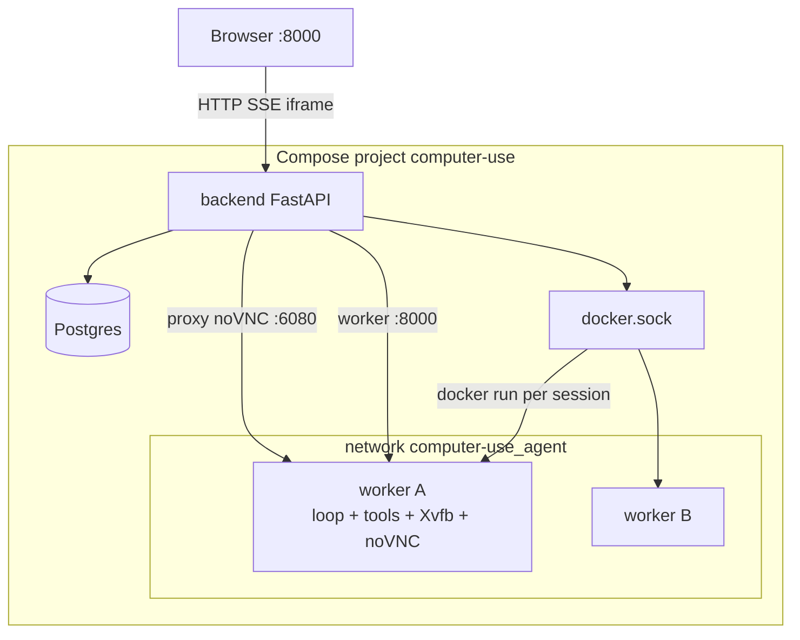
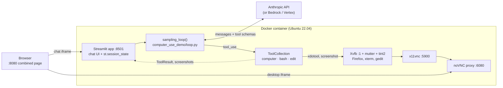

# Architecture

The design record for this project. The README covers what we are
building and why; this document covers how the new application attaches
to Anthropic's stack, what that inheritance constrains, and what each
new component does. HTTP shapes live in [api-design.md](api-design.md);
how to run Compose lives in [deployment.md](deployment.md).

## The boundary

The new application uses `computer-use-demo/` as a dependency. Upstream
code is not forked or edited; we call into it. That keeps us able to
pull upstream changes, and it keeps the interesting logic — sessions,
persistence, streaming — in code we own.

The seam is narrow. Everything we need from upstream is reachable
through one function and one class:

- `sampling_loop()` in `computer_use_demo/loop.py` runs a task to
  completion, reporting progress through three callbacks.
- `ToolCollection` in `computer_use_demo/tools/` executes the tool calls
  the model requests.

Our side supplies the message history, the API credentials, and the
callbacks; upstream supplies the loop and the tools. See
[`agent-loop.md`](agent-loop.md) for what happens between those calls.

### Deployment topology (settled)

The tools act on *the machine they run on*. `bash` spawns a local
shell, `edit` reads and writes the local filesystem, and `computer`
drives the local X display. There is no remote-execution path built
in. `sampling_loop()` also constructs `ToolCollection` internally, so
the loop and the tools cannot be split across a network without
forking `loop.py`.

That rules out "loop in the backend, tools in the desktop." What we
shipped is:

**One FastAPI backend. One worker container per session. The worker
contains the whole upstream stack** — `sampling_loop()`, the tools, and
the Xvfb/noVNC desktop. The backend owns sessions, Postgres, SSE, and
a reverse-proxy to that desktop. Two sessions bind in parallel: each
reserves a registry row, then both `docker run` without holding a lock
across startup.

A fixed YAML pool of two workers was rejected: the usage case requires
a dedicated desktop per new session, not a pre-declared pair. A shared
desktop with several X displays was rejected: `ComputerTool` reads
`DISPLAY_NUM` from the process environment, and `bash`/`edit` would
share one filesystem.

`computer-use-demo` is not an installable package. The worker image
inherits `computer_use_demo` from the upstream desktop image;
`worker/upstream.py` is the import seam (a `sys.path` insert when
running outside that image).

## Baseline: Anthropic's Computer Use Demo

Everything upstream runs inside one container: the agent, the tools it
calls, and the Linux desktop those tools drive.

### The tools

| Tool | Implementation |
| --- | --- |
| `computer` | Mouse, keyboard, and screenshots via `xdotool` and `gnome-screenshot`/`scrot` against `DISPLAY=:1` |
| `bash` | A persistent shell subprocess, held per tool instance |
| `str_replace_based_edit_tool` | Direct reads and writes on the local filesystem |

Tools are grouped into versioned sets in `tools/groups.py` so the
schemas stay in step with the model and its API beta flag. A fresh
`ToolCollection` is constructed on every `sampling_loop()` call, so tool
instances — including the bash subprocess — are per-invocation rather
than global.

### Processes and ports

| Port | Process | Role |
| --- | --- | --- |
| 8080 | `http_server.py` | Static page embedding the two iframes below |
| 8501 | Streamlit | Chat UI and all session state |
| 6080 | noVNC | Desktop in the browser (`/vnc.html`) |
| 5900 | x11vnc | Raw VNC for native clients |

`image/entrypoint.sh` starts the X stack, then noVNC, then Streamlit.

## Constraints inherited from the baseline

The agent stack is sound; the shell around it is what we are replacing.
Each of these is a requirement in disguise.

- **State is in memory, per browser session.** Conversation, tool
  results, and raw API responses live in `st.session_state`. One
  browser session is one agent, and nothing outside the process can see
  it.
- **Nothing is persisted.** Chat history dies with the process; only the
  API key and custom system prompt are written to `~/.anthropic/`.
- **There is no API.** The loop is driven from a Streamlit callback, so
  no other program can start a task or observe one.
- **Progress is reported by callback, not by stream.** `output_callback`,
  `tool_output_callback`, and `api_response_callback` fire synchronously
  inside the loop. They are the natural attachment point for our event
  stream, but something has to bridge them to a transport.
- **The tools are local and the desktop is singular.** Covered above; it
  is the reason concurrency has to be solved at the container or display
  level rather than with async alone.
- **The loop runs until the task ends.** `sampling_loop()` returns only
  when Claude stops requesting tools. Cancelling a running session is
  not something upstream supports, so we have to impose it from outside.

## Reuse, replace, add

| Upstream component | Plan |
| --- | --- |
| `sampling_loop()` | Reuse; drive it from the backend and bridge its callbacks into the event stream |
| `computer` / `bash` / `edit` tools | Reuse unchanged |
| Claude API integration and tool versioning | Reuse unchanged |
| Xvfb + x11vnc + noVNC desktop image | Reuse; provision per session |
| Streamlit UI | Replace with the FastAPI backend and the HTML/JS frontend |
| `st.session_state` | Replace with the session manager and the database |

## New components

### Session manager

Owns the lifecycle: create, look up, list, cancel, destroy. A session
pairs a conversation with a desktop. The first prompt starts a worker
container for that session (or reuses one already bound). Later prompts
keep the same desktop, because the conversation lives on that worker.
Deleting the session stops and removes the container.

A second prompt while a run is in flight is rejected with `409`. Queuing
would hide backpressure; interrupting would throw away work. The lock
is the session row itself: `ACTIVE → RUNNING` in the UPDATE's WHERE
clause, so two writers cannot both proceed.

Two sessions bind in parallel: each reserves a row, then both start
containers without holding a lock across Docker's startup. `MAX_WORKERS`
is a safety cap against a stampede, not a demo pool of two. Hitting the
cap is `503` with `Retry-After`. Tests and a warm `WORKER_URLS` list
still claim from a registry when provisioning is off.

`POST /sessions/{id}/messages` is the prompt path: bind, start a run on
the worker, and copy each event through `EventPublisher` so it is
numbered, persisted, screenshot-rewritten, and fanned out to the SSE
stream.

### Database

Persists chat history so it survives restarts and can be read by a
client that was not connected when the task ran.

Three tables: `sessions`, `events`, and `workers` — the last being the
pool registry the session manager claims from. Postgres in deployment,
SQLite in tests, reached through SQLAlchemy's async engine.

Every event carries a `seq`, its position in its session. Positions are
handed out by incrementing a counter on the session row in the UPDATE
itself and returning the result, so two writers appending at once get
disjoint ranges instead of both reading the same maximum. A unique
constraint on `(session_id, seq)` is the backstop. This matters because
the stream and the persisted history have to agree on ordering for a
reconnecting client to resume without gaps or repeats.

Screenshots arrive as base64 PNGs inside tool results, and they are
large and frequent. They are written to a blob store on the way in and
the row keeps only a reference, so reading history stays cheap for the
common case of wanting the text. The store is content-addressed by
digest, which collapses the many identical screenshots a run produces
when the screen does not change between steps.

**Deferred:** migrations. Tables are created directly while the schema
is still moving; a migration tool is the right answer once it settles.

### Streaming

`GET /sessions/{id}/events` is an SSE stream. A client that connects
late, or drops and comes back, starts from a `seq` (`from` or
`Last-Event-ID`) and is replayed out of the database, then handed to a
per-session bus for events that have not happened yet. The stream and
the rows agree on order because they share `seq`: the bus is subscribed
before history is read, so an event persisted during that read cannot
open a gap, and anything already yielded is skipped on the live tail.

The stream stays open across runs. A session can be prompted more than
once, and closing on `run_finished` would force every client to
reconnect for the next prompt.

A subscriber that falls behind is dropped rather than allowed to grow
an unbounded queue; it reconnects and replays. Idle connections get a
comment keepalive so proxies do not close them.

### VNC

`GET /sessions/{id}/desktop` reverse-proxies the bound worker's noVNC
(HTTP for `vnc.html` and its assets, WebSocket for `websockify`). The
client never sees the worker's 6080; that port stays on the private
network, and a session with no desktop is refused before a connection
is opened upstream.

A worker registered by API URL gets a `vnc_url` on the same host at
port 6080 unless one is supplied. The browser is redirected to
`vnc.html?autoconnect=1` so an iframe of `/sessions/{id}/desktop` is
enough.

### Frontend

The backend serves `frontend/` at `/`. The page lists sessions, creates
one, posts a prompt, tails `GET /sessions/{id}/events`, and embeds
`/sessions/{id}/desktop` in an iframe. Screenshots in the log are
fetched from `/blobs/{key}`. `/?session=<id>` selects a session so two
browser windows can each follow a different conversation. Same origin,
no build step — it is a demonstration of the backend, not a product
surface.

### Docker

Local development is a Compose file at the repository root: Postgres
and the backend on a user-defined bridge (`computer-use_agent`). The
worker *image* is built so the backend can spawn copies; no worker
service stays running. The backend mounts `docker.sock` and starts one
container per session on that network. Only the backend publishes a
host port (`8000`). Worker 6080 and 5900 are not published.

The loop, the tools, and the display stay together inside each spawned
worker — the topology that survives upstream constructing
`ToolCollection` internally.

Production is the same topology with a Compose overlay
(`compose.prod.yaml`): Swagger off, API on localhost, required
Postgres password, memory limits, persisted blobs. See
[deployment.md](deployment.md).

## Known limitations

- **`docker.sock` is host-equivalent access.** The backend must create
  containers. That is acceptable for a single-machine demo; it is not
  a multi-tenant isolation boundary.
- **No idle timeout.** A session holds its worker until `DELETE`.
  Forgotten sessions leak desktops until `MAX_WORKERS`.
- **No schema migrations.** Tables are created on startup.
- **Worker base image tag is mutable** unless `WORKER_BASE_IMAGE` is
  pinned to a digest.
- **Swagger is on in local Compose.** Production turns it off
  (`ENABLE_DOCS=0`). The demo UI is `/` either way.
